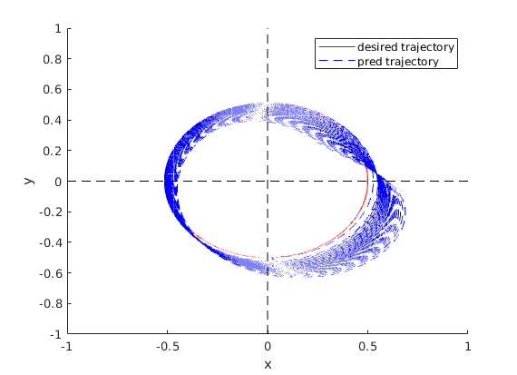

# Tracking Control
Codes of a submitted manuscript to Nature Communications.

[Model-free tracking control of complex dynamical trajectories with machine learning](https://www.nature.com/articles/s41467-023-41379-3) has been published in Nature Communications!

# Requirements
Please download the dataset at https://doi.org/10.5281/zenodo.8044994 <br>
The chaotic trajectories should be moved into the folder: read_data. The periodic trajectories are generated in the code

Note that we use a built-in package 'matsplit' in MATLAB. Please click 'Home', choose 'Add-Ons', search this package and install it to run the code.

# Example
Run 'main.m' with traj_type = 'circle', you will get the ground truth and tracked trajectories in the picture bellow: 



Change traj_type to others to track different trajectories, e.g., traj_type = 'lorenz'.  

# Citation
This work is available at [https://www.nature.com/articles/s41467-023-41379-3](https://www.nature.com/articles/s41467-023-41379-3), and can be cited with the followling bibtex entry:
```
@article{zhai2023model,
  title={Model-free tracking control of complex dynamical trajectories with machine learning},
  author={Zhai, Zheng-Meng and Moradi, Mohammadamin and Kong, Ling-Wei and Glaz, Bryan and Haile, Mulugeta and Lai, Ying-Cheng},
  journal={Nature Communications},
  volume={14},
  number={1},
  pages={5698},
  year={2023},
  publisher={Nature Publishing Group UK London}
}
```
